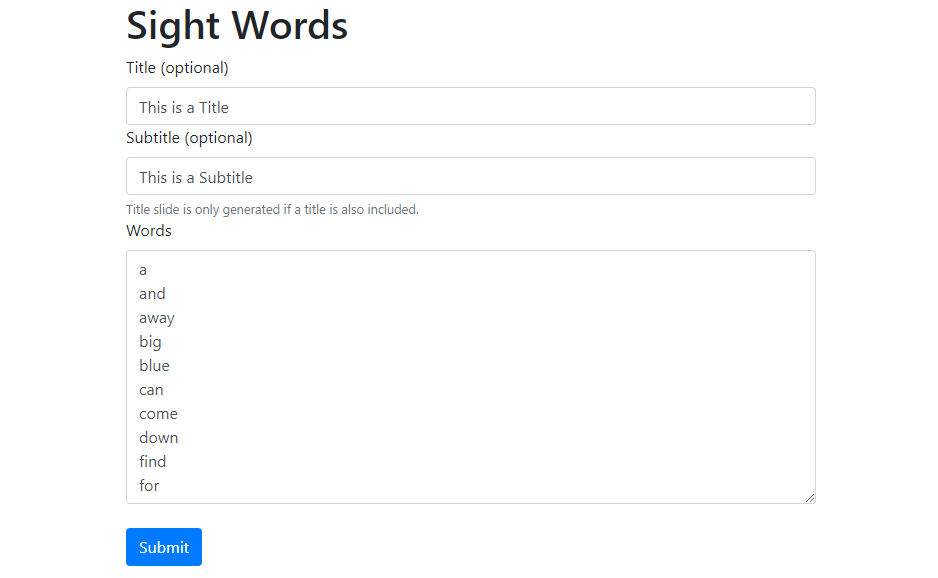
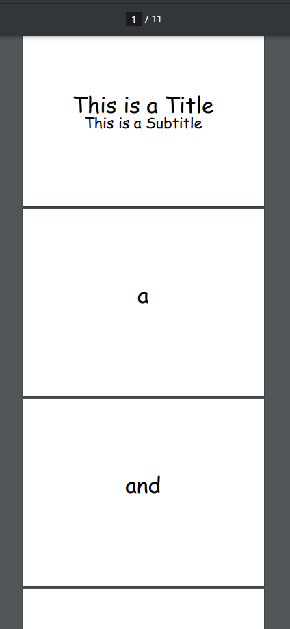

# Sight Words

## Background

Sight words are words that should be memorized to help a child learn to read and write. Learning sight words allows a child to recognize these words at a glance — on sight — without needing to break the words down into their individual letters and is the way strong readers recognize most words. Knowing common, or high frequency, words by sight makes reading easier and faster, because the reader does not need to stop to try and sound out each individual word, letter by letter.

Sight Words are memorized so that a child can recognize commonly used or phonetically irregular words at a glance, without needing to go letter-by-letter.

Other terms used to describe sight words include: service words, instant words (because you should recognize them instantly), snap words (because you should know them in a snap), and high frequency words. You will also hear them referred to as Dolch words or Fry words, the two most commonly used sight words lists. \[[source](https://sightwords.com/sight-words/#what)\]

## About the App

This app automates creating slides for teaching sightwords.

Screenshot of the sight words app:



Screenshot of the slides (pdf) produced by the sightwords app:



## Running the App Locally

1. Get Merriam-Webster API key and add to `.env`.

1. Run:

    ```
    sudo apt-get install poppler-utils ffmppeg
    pip install -r requirements.txt
    uvicorn sight_words.main:app
    ```

## Using the CLI

See `python cli.py -h`

## To do

- [x] CLI for generating slides
- [x] Webapp for generating slides
- [x] Optionally add title slide
- [ ] Video with pronunciation from Merriam-Webster
- [ ] Update pronunciations to a different voice
